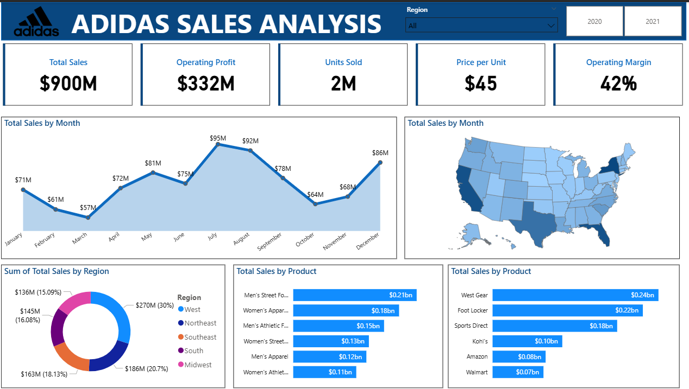

# 👟 Adidas Sales Performance Analysis (Power BI)
> **Empowering strategic growth and market competitiveness through data-driven insights.**

---

## 📖 1. The Narrative (Project Overview)
In the dynamic sports and athletic industry, staying ahead requires more than just a great product; it requires a deep understanding of market pulses. 

**The Goal:** This project aims to empower Adidas decision-makers with actionable insights. By analyzing sales dynamics, geographic potential, and product performance, we transform raw data into a strategic roadmap for improved profitability and optimized inventory.

---

## 🛠️ 2. The Transformation (Methodology)
Using **Power BI**, I processed a complex dataset covering the years **2020 and 2021** to create a high-performance analytics dashboard.

* **Data Integration:** Consistently handled invoices, regional data, and sales methods.
* **KPI Engineering:** Developed 5 core metrics using DAX to track real-time health:
    * **Total Sales:** [Price * Units Sold]
    * **Operating Profit**
    * **Units Sold**
    * **Average Price per Unit**
    * **Average Operating Margin (%)**
* **Geographic Intelligence:** Built a **Filled Map** to visualize state-by-state performance.

---

## 🖥️ 3. The Solution: Adidas Interactive Command Center
The dashboard provides a 360-degree view of the business, allowing for deep-dives into retailers, regions, and product categories.

> **Empowering strategic growth and market competitiveness through data-driven insights.**

---

## 📖 1. The Narrative (Project Overview)
In the dynamic sports and athletic industry, staying ahead requires more than just a great product; it requires a deep understanding of market pulses. 

**The Goal:** This project aims to empower Adidas decision-makers with actionable insights. By analyzing sales dynamics, geographic potential, and product performance, we transform raw data into a strategic roadmap for improved profitability and optimized inventory.

---

## 🛠️ 2. The Transformation (Methodology)
Using **Power BI**, I processed a complex dataset covering the years **2020 and 2021** to create a high-performance analytics dashboard.

* **Data Integration:** Consistently handled invoices, regional data, and sales methods.
* **KPI Engineering:** Developed 5 core metrics using DAX to track real-time health:
    * **Total Sales:** [Price * Units Sold]
    * **Operating Profit**
    * **Units Sold**
    * **Average Price per Unit**
    * **Average Operating Margin (%)**
* **Geographic Intelligence:** Built a **Filled Map** to visualize state-by-state performance.

---

## 🖥️ 3. The Solution: Adidas Interactive Command Center
The dashboard provides a 360-degree view of the business, allowing for deep-dives into retailers, regions, and product categories.

*(Note: Replace with your actual dashboard file name in GitHub)*

---

## 🔍 4. Key Performance Insights (The Results)
Based on the analysis of the **$900M** Sales Period:

* **Financial Powerhouse:** Total Sales reached **$900M** with an **Operating Profit of $332M** and a healthy **42% Operating Margin**.
* **Peak Periods:** The **Area Chart (Total Sales by Month)** reveals a significant peak in **July ($95M)** followed by a strong performance in August.
* **Product Performance:** **Men's Street Footwear** is the leading revenue driver, contributing **$0.21bn** to total sales.
* **Regional Dominance:** The **West Region** represents the largest market share at **30% ($270M)**, followed by the Northeast.
* **Retailer Impact:** **West Gear** and **Foot Locker** are the top-performing retailers, together driving nearly **$0.46bn** in sales.

---

## 💡 5. Strategic Recommendations
1.  **Inventory Optimization:** Increase stock levels for **Men's Street Footwear** and **Women's Apparel** during the Q3 peak (July-August) to prevent stockouts.
2.  **Regional Focus:** Replicate the successful strategies used in the **West Region** across the Midwest and South to boost their current market share.
3.  **Retailer Synergy:** Strengthen partnerships with **West Gear** and **Foot Locker**, while developing targeted marketing campaigns for retailers like **Walmart** to improve their sales contribution.
4.  **Pricing Strategy:** Maintain the **42% operating margin** by leveraging the **$45 average price per unit**, while testing premium pricing for top-selling footwear categories.

---

## 🔧 6. Technical Requirements Met
* **Total Sales by Month (Area Chart):** For peak period identification.
* **Total Sales by State (Filled Map):** To identify high/low potential geographic areas.
* **Total Sales by Region (Donut Chart):** To analyze regional contributions.
* **Total Sales by Product & Retailer (Bar Charts):** For competitive and inventory analysis.

---

